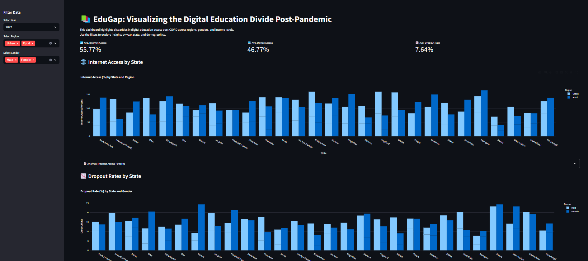
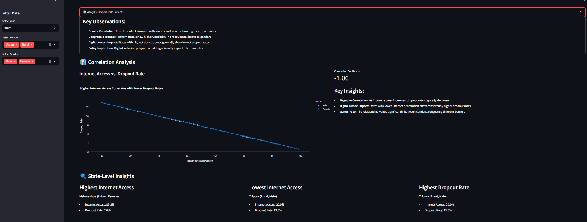

# edugap-india-dashboard
Interactive Streamlit dashboard visualizing the digital education divide in India post-pandemic, with insights by state, region, and gender.

# EduGap: Visualizing the Digital Education Divide Post-Pandemic

**EduGap** is an interactive Streamlit dashboard designed to explore and analyze disparities in digital education access across Indian states, regions, and genders in the post-pandemic era. This tool provides actionable insights for policymakers, educators, and researchers to address the digital divide and improve education equity.

---

## Features

- **📊 Visual Analytics**  
  - Bar charts for internet access and dropout rates by state, region, and gender.
  - Correlation scatter plots to analyze the relationship between internet access and dropout rates.
  - Time series visualization of device access trends (if time data is available).

- **🏙️ Urban-Rural & Gender Filters**  
  - Explore data by region (urban/rural) and gender to uncover hidden disparities.

- **📉 Key Metrics**  
  - Average internet access, device access, and dropout rates displayed as metric cards.

- **🔍 State-Level Insights**  
  - Highlights states with the highest and lowest internet access and dropout rates.

- **📝 Analytical Commentary**  
  - Built-in observations and policy implications for each visualization.

---

## Getting Started

### Prerequisites

- Python 3.8 or higher
- Required Python libraries: `streamlit`, `pandas`, `plotly`, `statsmodels`

### Installation

1. **Clone the repository:**
   ```bash
   git clone https://github.com/yourusername/edugap-india-dashboard.git
   cd edugap-india-dashboard
   ```

2. **Install dependencies:**
   ```bash
   pip install -r requirements.txt
   ```

3. **Run the dashboard:**
   ```bash
   streamlit run app.py
   ```

4. **Explore the dashboard:**  
   Open the provided URL in your browser and use the sidebar filters to analyze the data.

---

## Data

The dataset (education.csv) contains information on:
- Internet access percentages
- Device access percentages
- Dropout rates
- Segmentation by state, region (urban/rural), gender, and year

**Note:** The dataset used in this project is fictional and created for demonstration purposes. It does not originate from external organizations like ASER, NSO, MHRD, UNICEF, or UNESCO.

---

## Visualizations

1. **Internet Access by State**  
   - Bar chart showing internet access percentages by state and region.

2. **Dropout Rates by State**  
   - Bar chart displaying dropout rates by state and gender.

3. **Correlation Analysis**  
   - Scatter plot analyzing the relationship between internet access and dropout rates, with a regression trendline.

4. **State-Level Highlights**  
   - Cards highlighting states with the highest and lowest internet access and dropout rates.

5. **Time Series (Optional)**  
   - Line chart showing device access trends over time (if time data is available).

---

## Insights

- **Urban-Rural Divide:** Urban areas consistently show higher internet and device access compared to rural areas.
- **Gender Gap:** In rural areas, males tend to have higher internet access than females.
- **Regional Variations:** Southern states generally show more equitable access across genders.
- **Policy Implications:** States with high urban-rural divides or low digital access would benefit from targeted infrastructure investments and digital inclusion programs.

---
## 📖 edugap-india-dashboard




---

## Contributing

Contributions are welcome! If you'd like to improve this project, please follow these steps:

1. Fork the repository.
2. Create a new branch (`git checkout -b feature-branch`).
3. Commit your changes (`git commit -m "Add new feature"`).
4. Push to the branch (`git push origin feature-branch`).
5. Open a pull request.

---

## License

This project is licensed under the MIT License. See the LICENSE file for details.

---

## Acknowledgments

- Built using [Streamlit](https://streamlit.io/) and [Plotly](https://plotly.com/).
- Data is fictional and created for demonstration purposes.

---

**EduGap** empowers data-driven decisions to bridge the digital divide in Indian education.
